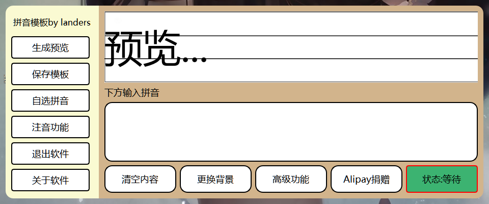
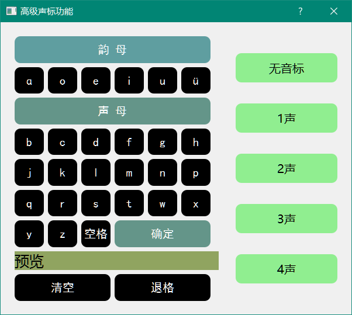

# 拼音模板 demo手册

## 功能：

1. 用户输入拼音字母制作成模板图片
2. 使用拼音自选功能，快速选择音标
3. 提供预览（因为布局问题有些许错位，不影响保存）
4. 高级功能：汉字注音（还未完成）

## 界面

## 新建模板

在输入框中输入字母

点击功能按钮`生成预览`查看效果

## 保存

预览无误后，点击按钮`保存模板`

成功会在右下角的状态栏提示

图片会默认保存在`C:\\Users\Administrator\Desktop` 也就是桌面

## 清空内容

点击按钮`清空内容`会清空所有输入

## 更换背景

提供两种背景切换（可能很丑吧）
点击按钮`更换背景`切换

## 高级功能

目前只完成了自选拼音的功能，首先点击`高级功能`按钮，会跳出激活框，输入激活码即可

激活码如下：

- 0到50间的素数个数
- 哪位科学家的棺材板总是被按住（中文名）
- 名侦探柯南中使新一变小的药物（大写）
- 复仇者联盟1的上映年份
- 玻尔兹曼常数的前六位
- 我名字的拼音首字母小写
- 经常使用花呗的人欠谁钱

输入激活码后再次点击左侧的`自选拼音`按钮即可使用该功能

不激活会出现如下提示

激活成功后进入高级功能界面

## 拼音自选框的使用

声母部分因为不存在音标直接点击对应字母就会添加进最终的字母串，最后点击`确定`按钮应用，然后进入主界面，点击`生成预览`即可查看

韵母部分包含音标，如果输入韵母没有音标声调，先点击对应字母，再点击无音标
如果有音标，先点击对应字母，再点击声调

例如：

​	a = a + 无音标
​	ā = a + 一声

在自选框编辑的文字可直接在下方预览框内预览

最后点击`确定`，`生成模板`查看

拼音自选框作为辅助界面，可以移动到主界面的旁边，方便预览修改

## 捐赠

点击按钮`Alipay捐赠`，扫描支付宝收款码即可向我打钱

## 问题

软件主程序和图片资源必须在同一目录下，删除图片不影响使用，但是软件依赖的图片资源会失效
因为没使用qt的转码工具所以图片不能打包进主程序里

软件使用独立字体，需要在和软件同目录下使用